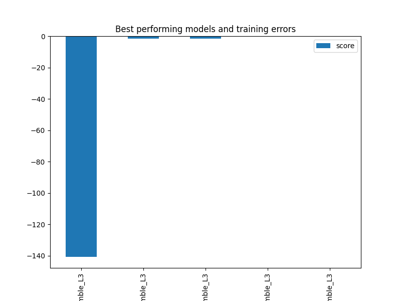
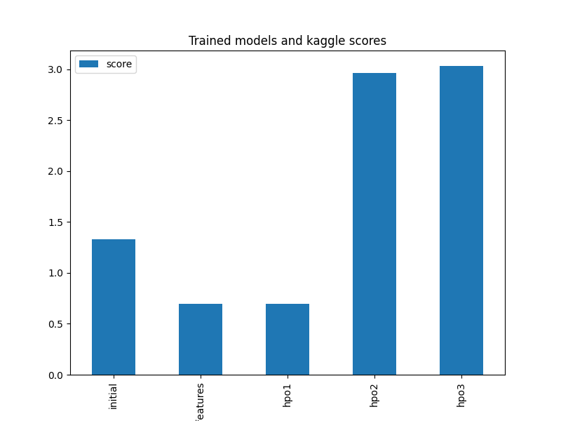

# Bike Sharing Demand Prediction with AutoGluon
#### Uyanga Jung

## I. Baseline model

The followings were observed from the bike sharing data:

1. The `train` dataframe consists of `12 columns` and `10886 rows` and `test` dataframe consists of `9 columns` and `6492 rows`. Both dataframes don't contain any missing values and some columns' datatypes were not imported correctly such as `datetime`. 
1. The `casual` and `registered` columns were present in `train` and missing from `test` data. 
1. The column `atemp` is highly correlated to `temp` column which needs to be considered when modelling.
1. The columns `temp` (`atemp`) and `windspeed` may require scaling to make the values more uniform.
1. If used, `casual` and `registered` columns need to be scaled considering the large value range compared to the other columns.

### 1.1. Data preperation

In this section, the baseline model was performed as:

1. The train and test data were used without any transformation, train and test split, model tuning or feature engineering.
1. The columns mentioned [above](#data-description) were not corrected or datatypes were not changed.
1. To make the datasets same, `casual` and `registered` columns were not included in the training data.
1. `datatime` column was not included in both `train` and `test` data.

### 1.2. Modeling

__Configuration__:

- `target`: `count`
- `metric`: `root_mean_squared_error`
- `time_limit`: `600`
- `presets`: `best_quality`
- `number of variables`: `9`

__Results__:

The top 5 models with the lowest `root_mean_squared_error`:

`Submission score: 1.32753`

| Model | RMSE |
|---|---|
| `WeightedEnsemble_L3` | -140.69 |
| `ExtraTreesMSE_BAG_L2` | -141.43 |
| `CatBoost_BAG_L2` | -141.65 |
| `LightGBMXT_BAG_L2` | -141.72 |
| `WeightedEnsemble_L2` | -141.99 |

## II. Feature engineered model

### 2.1. Data preperation

To improve the baseline model's performance, the following changes were made:

1. The `season`, `weather`, `workingday` and `holiday` variables were converted to `categorical`.
1. The variable `datetime` was converted to `datetime` type and `weekday` and `hour` variables were extracted.`datetime` variable was removed.
1. Considering the high correlation between `temp` and `atemp`, and `atemp` is the adjusted value for `temp`. Therefore, `atemp` was chosen to represent the temperature.
1. The variables `casual` and `registered` were included in the `test` data. Due to the distinct trends observed, the average of `weekday` and `hour` by `weekday` and `hour` was used.
1. The variables `casual`,`registered`,`humidity` and `atemp` were scaled using `StandardScaler`.

### 2.2. Modeling

__Configuration__:

- `target`: `count`
- `metric`: `root_mean_squared_error`
- `time_limit`: `600`
- `presets`: `best_quality`
- `number of variables`: `11`

__Results__:

The top 5 models with the lowest `root_mean_squared_error`:

`Submission score: 0.69489`

| Model | RMSE |
|---|---|
| `WeightedEnsemble_L3` | -1.64 |
| `RandomForestMSE_BAG_L2` | -1.72 |
| `WeightedEnsemble_L2` | -1.94 |
| `LightGBM_BAG_L2` | -2.10 |
| `ExtraTreesMSE_BAG_L1` | -2.39 |

The model performance improved significantly. Adding more features definitely helped to improve the performance of the model. RMSE is reduced almost 7 times and the submission score is reduced 2 times compared to the baseline model.

## III. Hyper parameter tuned models

_Note: the hyperparameter tuning was done on higher level parameters of AutoGluon not on specific model or estimator level. Although it is possible to tune the estimators, not much information was available in the documentation to perform estimator level hyperparameter tuning for tabular predictors. The individual estimators' hyperparameter tuning was attempted following [this](https://auto.gluon.ai/stable/tutorials/tabular_prediction/tabular-indepth.html), however, the technical issues were not solved and yeilded no result. The higher level hyperparameters were referenced [here](https://docs.aws.amazon.com/sagemaker/latest/dg/autogluon-tabular-hyperparameters.html). The hyperparameters were tuned manually rather than automated manner such as `GridSearch`._

__Configuration__:

- `target`: `count`
- `metric`: `root_mean_squared_error`
- `presets`: `best_quality`

|  | Baseline | F.Engineered | Tuned1 | Tuned2 | Tuned3 | 
|---|---|---|---|---|---|
| # of Features | 9 | 11 | | | |
| Updated features | - | Mentioned [here](#2-1-data-preperation) | [2.1.](#2-1-data-preperation) | - 1. `weekday` converted to `categorical`   - removed `casual` and `registered`   - Added `type_hour` variable: 1-peak hour, 2-night time, and 3-day time   - Added `year`, `month`, `day` variables| The same as Tuned2 |
| Parameters* | - `time_limit`: `600` | - `time_limit`: `600` | - `time_limit`: `900`   - `num_bag_folds`:`2` | - `time_limit`: `900`   - `num_bag_folds`:`2`   -`num_bag_sets`:`2` | - `time_limit`: `900`   - `num_bag_folds`:`3`   -`num_bag_sets`:`3`   - `num_stack_levels`:`1` |
| Train valid split valid size | - | - | - | 0.2 | 0.2 |
| The best model training error | -140.69 | -1.64 | -1.64 | -0.009 | -0.009 |
| Kaggle score | 1.327 | 0.695 | 0.694 | 2.965 | 3.031 |

`*` Indicates only updated parameters

The tuned models started performing better than the baseline and feature engineered models. Increasing model training time and adjusting 2 hyperparameters didn't improve the kaggle score much (`Tuned1`). In `Tuned2`, more features were generated and added and certain parameters were adjusted. However, parameter adjusted models overfit the training data. As you can see, the best model's performance or the error rate was significantly lower (-0.009) for `Tuned2` model, however, kaggle score is higher than the untuned model. This could be due to:

1. We didn't tune the estimators. The performance of the autogluon model may improve if we tune the individual estimators.
1. Changing higher level parameters adding more complexity to the model training job.
1. The demand is given by timestamps, in a way the data is time series data. However, in this project, the it was treated as a regression task rather than time series. Therefore, time series related variables were not generated or included in the data.

## Summary

In this project, we used `AutoGluon` to train and predict demand for bike sharing service. The training data consists of `12 columns` and `10886 rows` and `test` dataframe consists of `9 columns` and `6492 rows`. The timestamp ranged from 2011 to 2013 and the data was given by hourly frequency. I trained 5 AutoGluon models, however, the models were not tuned on the estimator level. The best performing model based on kaggle score is the feature engineered model. When the higher level parameters were adjusted, the models tend to overfit. It could be due to the reasons that I mentioned in the [III. Hyper parameter tuned models](iii-hyper-parameter-tuned-models).
