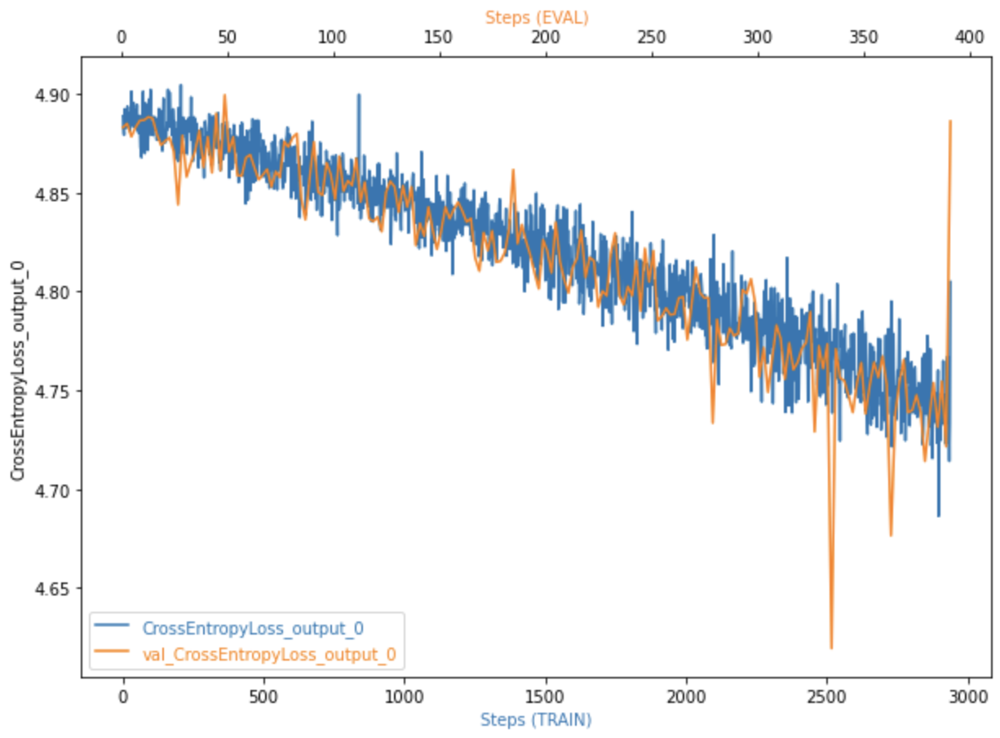
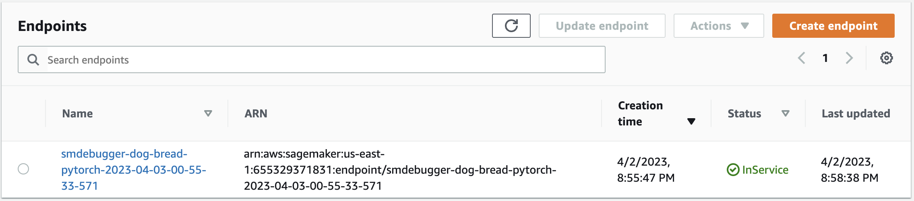

# Image Classification using AWS SageMaker

Use AWS Sagemaker to train a pretrained model that can perform image classification by using the Sagemaker profiling, debugger, hyperparameter tuning and other good ML engineering practices. This can be done on either the provided dog breed classication data set or one of your choice.

## 1. Project Set Up and Installation

The following packages were used:
- `sagemaker` (lastest version)
- `boto3` (lastest version)
- `numpy` (lastest version)
- `torch` (lastest version)
- `torchvision` (lastest version)
- `argparse` (lastest version)
- `os` (lastest version)
- `smdebug` (lastest version)

The hyperparameter tuning config:
- `instance type`: `"ml.m5.xlarge"`
- python version: `3.6`


## 2. Dataset
The dataset is a dog bread data that contains 133 different dog breads. The data contains `train`, `valid` and `test` datasets. The data was downloaded from Udacity's S3 bucket and uploaded to my personal S3 bucket to use.

## 3. Hyperparameter Tuning

### 3.1. The model structure:

- Pretrained `ResNet50`
- Fully connected layer was replaced by the following structure
```
nn.Sequential(
    nn.Linear(num_features, 2048),
    nn.ReLU(inplace=True),
    nn.Linear(2048, 516),
    nn.ReLU(inplace=True),
    nn.Linear(516, 133)
)
```

### 3.2. The following hyperparameters were tuned:
- `lr`: `ContinuousParameter(0.001, 0.1)`
- `batch-size`: `CategoricalParameter([32, 64])`

### 3.3. Best estimator & parameters

The completed hyperparameter tuning job is shown below.


| Best Estimator Parameters |
|---|
| - `lr`:0.00153 <br> - `batch-size`:64 |

## 4. Debugging and Profiling

The best model from the hyperparameter tuning was selected and the parameters are below.

### 4.1. Debugging and profiling setup

The rules were defined as below.
```
rules = [
    Rule.sagemaker(rule_configs.vanishing_gradient()),
    Rule.sagemaker(rule_configs.overfit()),
    Rule.sagemaker(rule_configs.overtraining()),
    Rule.sagemaker(rule_configs.poor_weight_initialization()),
    ProfilerRule.sagemaker(rule_configs.ProfilerReport()),
]
```

The following hooks were defined:

- `train.save_interval`: `1`
- `eval.save_interval`: `1`
- `predict.save_interval`: `1`


### 4.2. Debugging and profiling results

The model trained successfully and the validation accuracy at the end of the training was `20%`.


The model's training and validation error plot is shown below.



Based on the model training and validation error plot, both errors are decreasing. This means that there's a potential to reduce the error and increase the accuracy. We only trained the model for 16 epochs. More epochs are needed to reduce the error. 


## 5. Model Deployment

The trained estimator was deployed with the following configuration.

- `initial_instance_count`=`1`, 
- `instance_type`=`"ml.m5.2xlarge"`

The endpoint was created without any problem.



The test image was randomly sampled from `./dogImages/test` folder and the following image was passed to the endpoint for inference.


The model predicted the image as label `42` which indicates that the model is not well-trained. It shows that model needs to be trained for more epochs to increase the accuracy.


----